# Captone Project: Enhancing a Community Library Website

### Bacground Scenario

Been part of a development team tasked with enhancing the website for the "Greenwood Community Library". The website aims at be more engaging and informative for its visitors. Its currently includes basic section: Home, About US, Events, and Contact US. My team decided to add a "Book Reviews" section and update the "Events" page to feature upcoming community events. 

I will simulate the roles of two contributors: "Morgan" and "Jamie". Morgan will focus on adding the "Book Reviews" section. while "Jamie" will update the "Events" page with new community events. 

## Objectives

- Practice cloning a repository and working with branches in git.
- Gain experince in stagging, commiting, and pushing changes from both developers.
- Create pull requests and merge them after resolving any potential conflicts.

## Setup

1. Create a repository on GitHub:

  - Name it greenwood-library-website.

    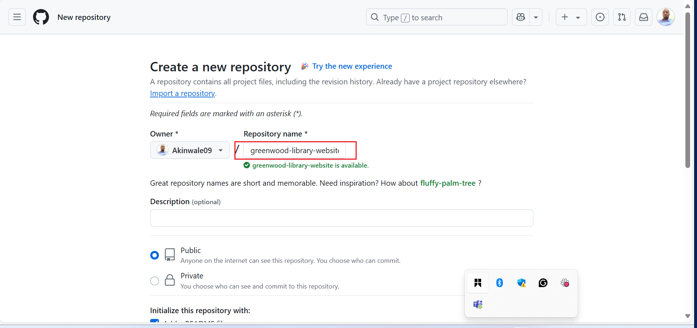

  - Initialized it with a README.md file and clone it to my local machine. 

    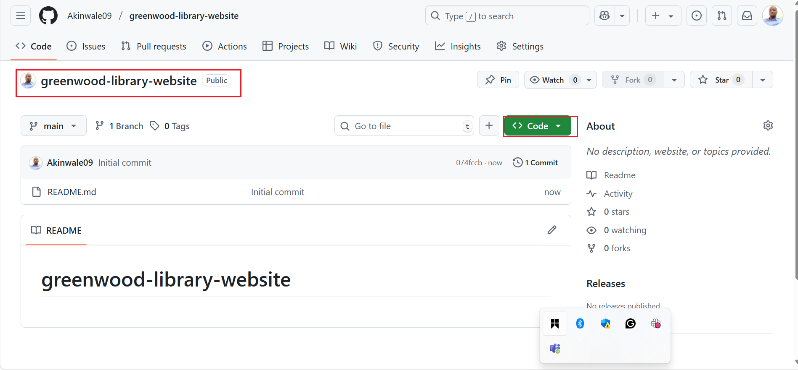

    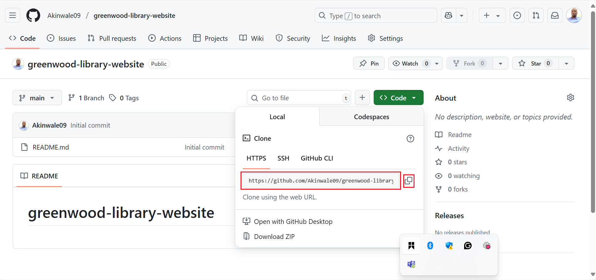

    

    

## Tasks

1. In the main branch, using Visual Studio code editor, I will ensure there are files for each of the web pages.

    - home.html
    - about_us.html
    - events.html
    - contact.html

  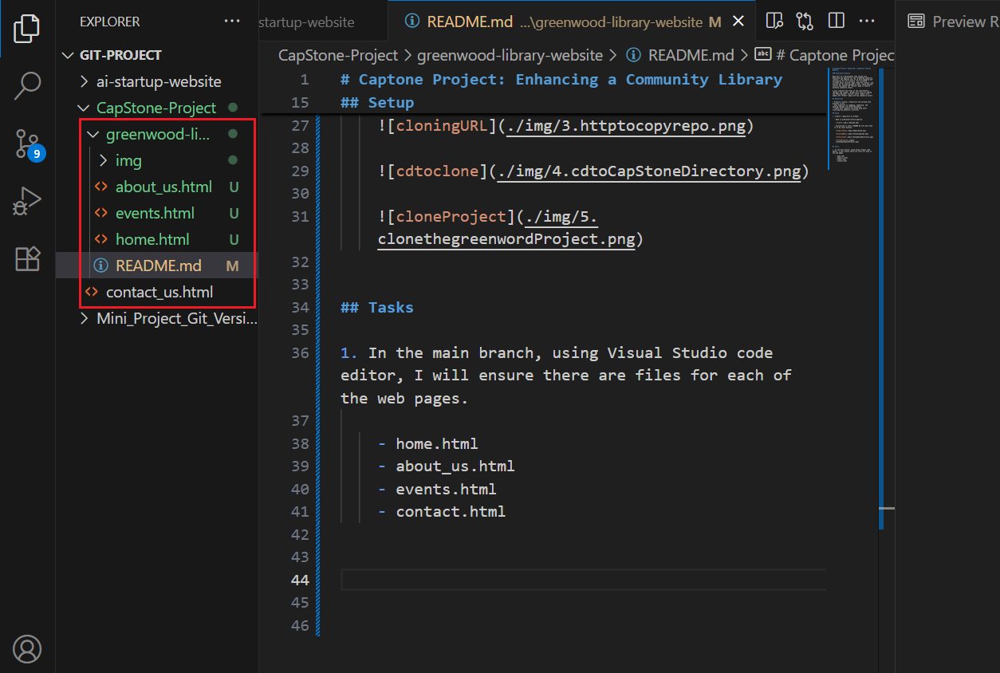

 
2. I will add random content into each of the files. 
    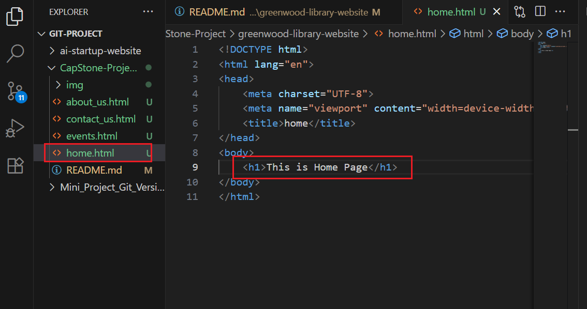

    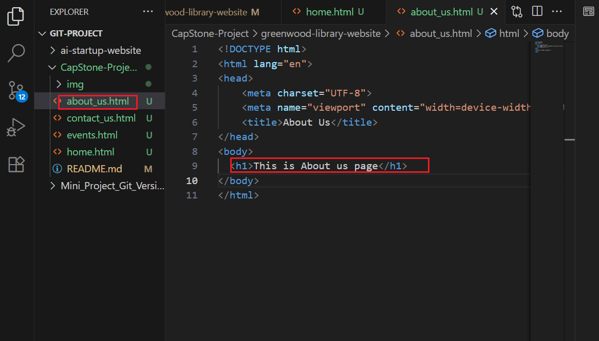

    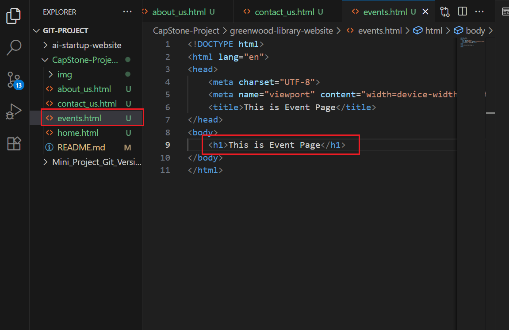

    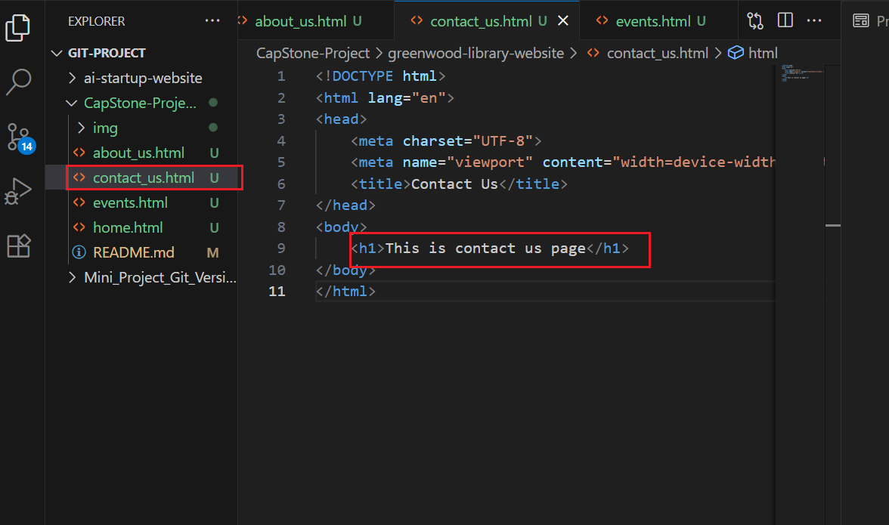

3. I will stage, commit, and push the changes directly to the main branch. 

   `git status`

  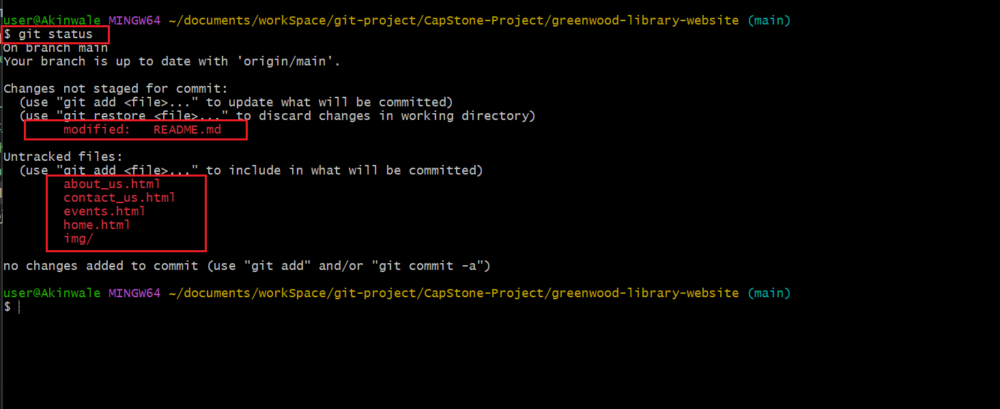
  
   `git add`

   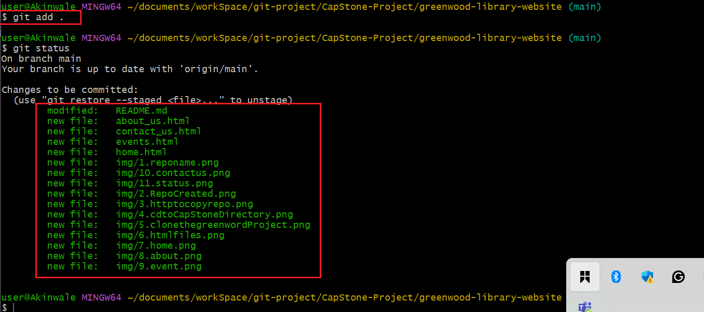

   `git commit -m "message"`

   

   `git push`

   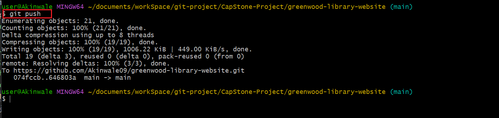

### Morgan's Work: Addidng Book Reviews  

1. I will create a Branch for Morgan

2. Swicth to a new branch name add-book-reviews

