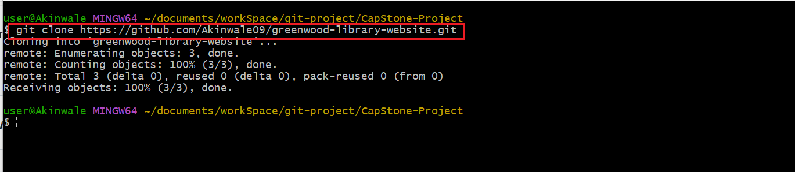
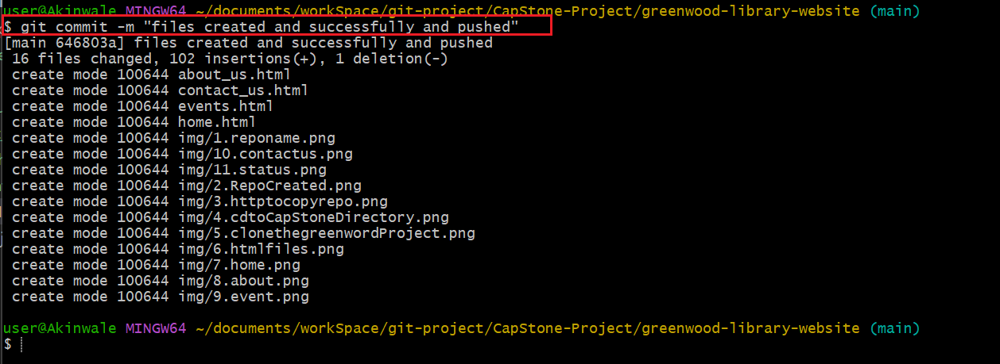

# Captone Project: Enhancing a Community Library Website

### Bacground Scenario

Been part of a development team tasked with enhancing the website for the "Greenwood Community Library". The website aims at be more engaging and informative for its visitors. Its currently includes basic section: Home, About US, Events, and Contact US. My team decided to add a "Book Reviews" section and update the "Events" page to feature upcoming community events. 

I will simulate the roles of two contributors: "Morgan" and "Jamie". Morgan will focus on adding the "Book Reviews" section. while "Jamie" will update the "Events" page with new community events. 

## Objectives

- Practice cloning a repository and working with branches in git.
- Gain experince in stagging, commiting, and pushing changes from both developers.
- Create pull requests and merge them after resolving any potential conflicts.

## Setup

1. Create a repository on GitHub:

  - Name it greenwood-library-website.

    

  - Initialized it with a README.md file and clone it to my local machine. 

    

    

    

    

## Tasks

1. In the main branch, using Visual Studio code editor, I will ensure there are files for each of the web pages.

    - home.html
    - about_us.html
    - events.html
    - contact.html

  

 
2. I will add random content into each of the files. 
    

    

    

    

3. I will stage, commit, and push the changes directly to the main branch. 

   `git status`

  
  
   `git add`

   

   `git commit -m "message"`

   

   `git push`

   

### Morgan's Work: Adding Book Reviews  

1. I will create a Branch for Morgan
  
    `git checkout -b add-book-reviews`

   

2. Swicth to a new branch name add-book-reviews

   

3. Add a new file "book_reviews.html" to represent the book reviews sections:
 
     `touch book_review.html`
   

4. Add a random text content into the file

    

5. Stage, commit, and push chnages with a message "Add book reviews sections."
  
     `git status`

    

     `git add .`

    

    `git commit -m "message"`

    

    `git push`

6. Push the "add-book-review" branch to GitHub

    

7. Raise a PR (Pull Request) for Morgan's work

    

8. Merge Morgan's work to the main branch.

     

     

### Jamie's Work: Update Event Pages

We would repat thesame flow for Jamie's work on Events pages. we would ensure Jamie's work is in "update-events" branch. 

